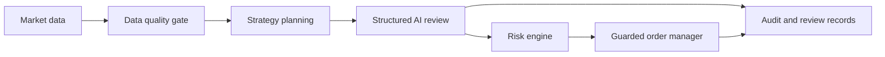

# Binance AI Trader — Testnet Engineering Prototype

A Python prototype for an AI-assisted spot-trading pipeline on Binance Testnet. The engineering focus is structured review, explicit execution controls, data quality, audit records, and reproducible diagnosis.

## Architecture



AI modules produce review data; order execution remains a separate guarded path. Dry-run, kill switches, and execution settings are documented in the development guide.

## Repository guide

| Area | Modules |
| --- | --- |
| Market data and features | `binance_client/`, `features/`, `data_quality/` |
| Planning and review | `strategies/`, `ai/` |
| Execution controls | `risk/`, `orders/`, `broker/`, `account/` |
| Runtime and inspection | `runtime/`, `dashboard/`, `journal/`, `diagnostics/` |
| Offline evaluation | `backtest/`, `shadow/`, `tests/` |
| Detailed operation notes | [Development guide](docs/development-guide.md) |

## Offline development

Python requirements and dependencies are recorded in `pyproject.toml`. For a local development environment:

```sh
uv venv .venv
uv pip install -e .
source .venv/bin/activate
python -m pytest
```

The existing test suite uses fake clients and brokers and is documented to run without exchange or OpenAI keys. Testnet integration and account-connected commands are separate workflows in the guide.

## Status

This repository is a Testnet MVP. Live execution is disabled by default. The cleanup changes documentation and navigation, and preserves existing controls, strategy code, and tests.

No new exchange execution, AI API calls, benchmark results, or profitability claims are produced by this cleanup. Backtest and shadow observations should be read with their documented assumptions.

See [validation record](docs/validation.md), [engineering rules](AGENTS.md), and [detailed development guide](docs/development-guide.md).
